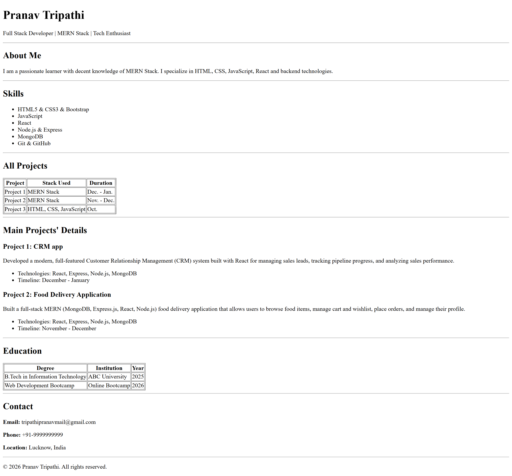

# Resume Website - HTML Assignment

A single-page resume website built using pure HTML without any CSS styling. This project demonstrates proper HTML structure, semantic tags, and clean code organization.

## 🚀 Setup Instructions

### Prerequisites

- A web browser (Chrome, Firefox, Safari, Edge, etc.)
- A text editor (VS Code, Sublime Text, Notepad++, etc.)

### Steps to Run Locally

1. **Download the project**
   - Download the `index.html` file from this repository
   - Or clone the repository:
     ```bash
     git clone <repository-url>
     ```

2. **Navigate to the project folder**

   ```bash
   cd <project-folder-name>
   ```

3. **Open the HTML file**
   - Double-click on `index.html` to open it in your default browser
   - OR right-click → "Open with" → Choose your preferred browser
   - OR drag and drop the file into a browser window

4. **View the website**
   - The resume website will display in your browser

## 📸 Screenshot

### Full Page View


